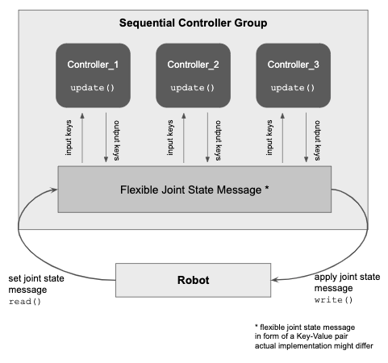
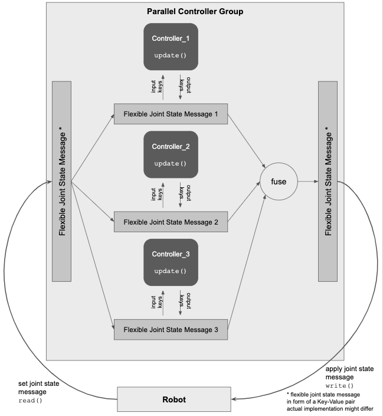

# Controller Execution Management

The following shall discuss the execution of loaded controllers inside the `ControllerManager`.
As of today, the loaded controllers are processed in a sequential order which doesn't allow for much flexibility or interoperability between the controllers.
We identified a few essential criteria when it comes to the execution of controllers:

* Sequential Execution of Controllers
* Parallel Execution of Controllers
* Nesting Controllers
* Variable Frequencies of Controllers

We'll go into more details below for each aspect.

## Prerequisites

<Go into some needed details of a flexible joint state message>

## Sequential Execution of Controllers

All loaded controllers are currently executed in a strict round-robin order.
That is, there is a tight order starting from `Controller_1`, `Controller_2`, …, `Controller_N`, where all controllers are running independent from each other.

### Controller Chaining

One requirement we'd like to see is a more flexible controller chaining.
Controller chaining still implies a fixed configuration in which order the controllers are being executed, however with shared resources.
A typical use case for this is a safety `JointLimitsController` which is being linked after a `JointEffortController` to enforce an operation within appropriate min/max torque values.
Another use case could be to clamp a `DiffDriveController` velocity values to optimize for battery lifetime or top acceleration.

In order to realize such a controller chaining, the output of one's controller must be linked as the input to its consecutive controller.
This further motivates a relaxation that resources such as the `JointHandle` can only be uniquely claimed.

### Sequential Controller Container

Instead of loading each controller individually as an independent controller, we propose a parent container which holds and connects controllers which are configured in a specific order.
The container has a single input and a single output which is being scoped within the container.
That is, all controllers loaded within a container don't see any input/output states outside the container.
The input and output states can then be safely re-routed and linked between individual controllers.
After all controllers are executed, the final output state is being returned from the container.

The image below shows how this execution model could look like:

## Parallel Execution of Controllers

Opposite to the sequential order, there are use cases where it makes sense to operate controllers in a parallel fashion.
`Controller_1`, `Controller_2`, …, `Controller_3` are being executed in parallel/isolated and their output state is being fused with a specific function.

### Separation of Tasks

Having controllers being run in parallel allows a better separation of tasks per controller.
One easy to grasp example (also if not the most sensible) is a simple `PID-Controller`.
We could break down each gain (`P`, `I`, `D`) in its own controller and let them calculate in isolation.
By being able to execute multiple controllers in parallel, the calculation of the actual output can then be to simply add the `P`, `I`, `D` outputs - according to the control law of `p * (x_d - x) + p * (x_d - x) / dt  + i * sum(x_d -x) * dt`.
A second use case could be again a differential drive controller which computes rotational and translational velocities and a second controller calculates dynamic friction values which then again can be fused together.

### Parallel Controller Container

Just like in the sequential execution, we propose having a container structure which holds a set of loaded controllers which are being executed in parallel and primarily independent from each other.
When all controllers were executed, each individual calculated values are being joined.
As already mentioned previously, this parallel container can be initialized with a custom designed operation which dictates how all commonly calculated values (e.g. `torques`) are being combined.

The parallel container also has only one input and one output state.
However, the input state has to be multiplexed (essentially copied) for each controller and can't be shared in order to guarantee and isolated execution where no other controller within the same container can interfere.

The image below shows how this execution model could look like:

## Nested Controllers

In both cases, the sequential as well as the parallel container can be controllers in itself.
That gives the flexibility to easily nest the container within another container transparently.
Again, a very simple scenario could be a parallel `PID` controller setup which is then being configured within a sequential container to enforce joint limits.
This further allows to consider maybe very complex configured containers as black boxes, yet have the freedom to extend these fairly easy.

The image below shows how this execution model could look like:

## Variable Controller Frequencies

<TBD example of gripper/camera running with 20hz where as joint state controller runs with 1khz>

## Implementation - Proof of Concept

for full details see https://github.com/Karsten1987/cm_poc
